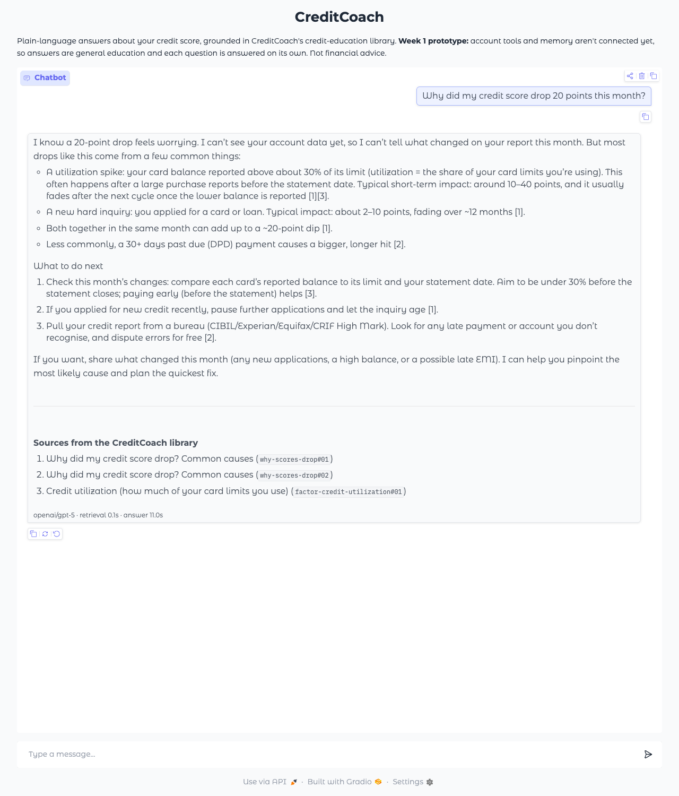

# Task 11 Evidence: Gradio Chat UI and Shareable Link

*2026-09-24 · Code: `creditcoach/app/main.py` · Run: `uv run python -m creditcoach.app --share`*

**Definition of Done:** the Gradio app launches and returns a grounded explanation for a real query. **Evidence:** a screenshot of the running UI, plus the shareable link posted to the team channel.

## Screenshot of the running UI



The UI shows the Week 1 demo goal working end to end. The question "Why did my credit score drop 20 points this month?" gets a grounded explanation that:
- says it can't see the user's account data yet;
- explains the common causes with typical ranges from the corpus, labeled as typical;
- cites passages [1]–[3];
- lists the three library sources, the model, and the timings.

## Shareable link

`uv run python -m creditcoach.app --share` created a public gradio.live link, logged at startup:

```
INFO creditcoach.app: Retrieval models loaded in 14.1s
INFO creditcoach.app: CreditCoach running at http://127.0.0.1:7860/
INFO creditcoach.app: Public share link (expires in about 1 week, stops when this process stops): https://dcdfbabd775eeefc7f.gradio.live
```

**The link worked from outside the machine.** The same question sent through the public URL returned a grounded, cited answer in **9.0 s** (model 6.7 s, retrieval 0.1 s). The app was then stopped, which closes the link (it now returns 404), so the OpenRouter key isn't exposed while nobody is using it.

**To share with the team** (the second half of the evidence), relaunch with a login and post the new link:
1. Add `APP_USERNAME=...` and `APP_PASSWORD=...` to `.env`.
2. Run `uv run python -m creditcoach.app --share` and copy the "Public share link" line.
3. Post the link and the login in the team channel. Keep the process running while teammates try it.

| Posted to team channel | Link | By | Date |
|---|---|---|---|
| [ ] | | | |

## What the UI does

- **Chat:** each question runs the Task 10 pipeline: retrieve the top 3 passages → GPT-5 → cited answer. Every question is answered on its own, since memory arrives in Week 2. The UI description says so, along with "Not financial advice".
- **Sources:** listed under each answer with passage ids, so grounding is visible.
- **Example questions:** score drop, utilization, payday loan, guarantee.
- **Fast first answer:** the embedding and reranker models load at startup (about 14 s) instead of on the first question.
- **Graceful failure:** if the model call fails, the user sees a plain apology instead of a stack trace, and the error is logged.
- **Privacy:** Gradio's usage analytics are turned off (0 telemetry requests in the startup log).
- **Security:** optional login via `APP_USERNAME` / `APP_PASSWORD`. Starting a share link without one logs a warning.

## Issues found and fixed while building

| Issue | Fix |
|---|---|
| GPT-5 took **14–37 s** per answer at its default reasoning effort, too slow for a live demo | New `REASONING_EFFORT` setting, default `low`: answers now take about 7–11 s. The Task 10 checks were re-run at `low`: the score-drop and guarantee answers pass every check and still say they can't see account data. One of three payday runs flagged "the next 1–2 steps", a conversational count rather than a financial figure. |
| Gradio sent usage analytics to its servers by default | Disabled in the app |
| The public URL never appeared when output went to a log file (Gradio prints it to buffered stdout) | The app now logs the local URL and the share link itself |
