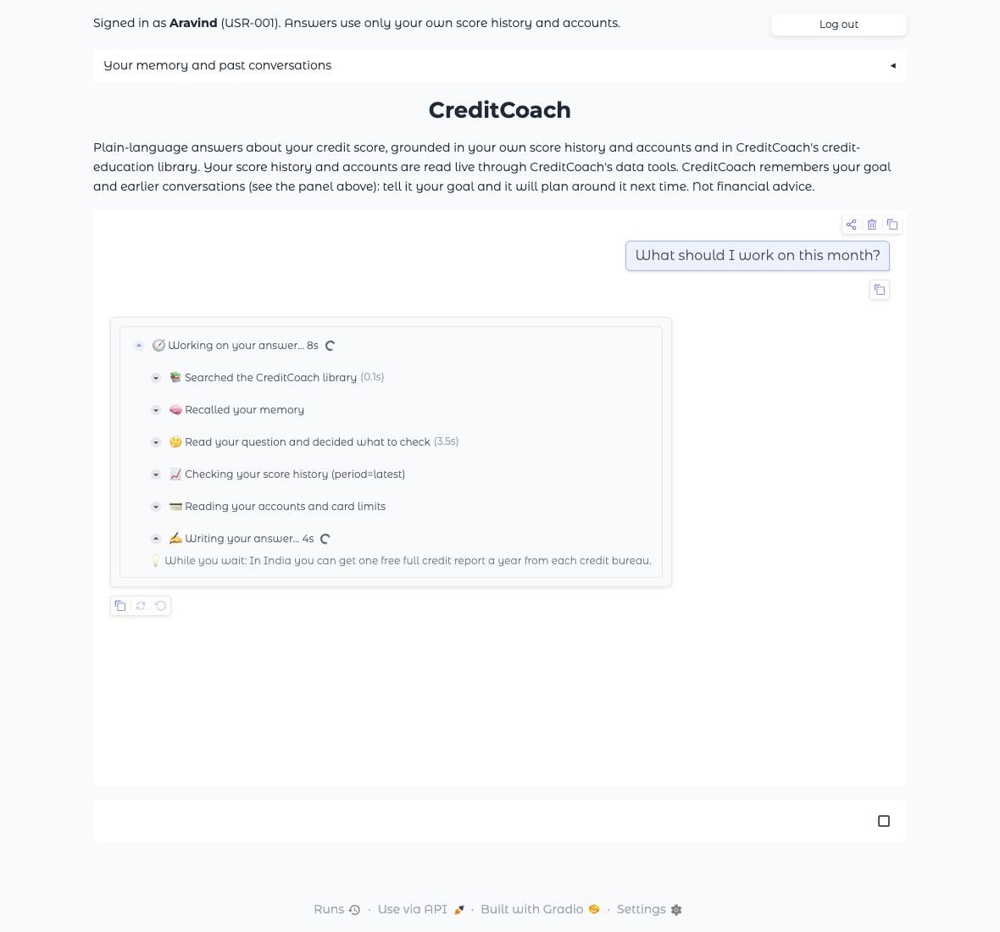
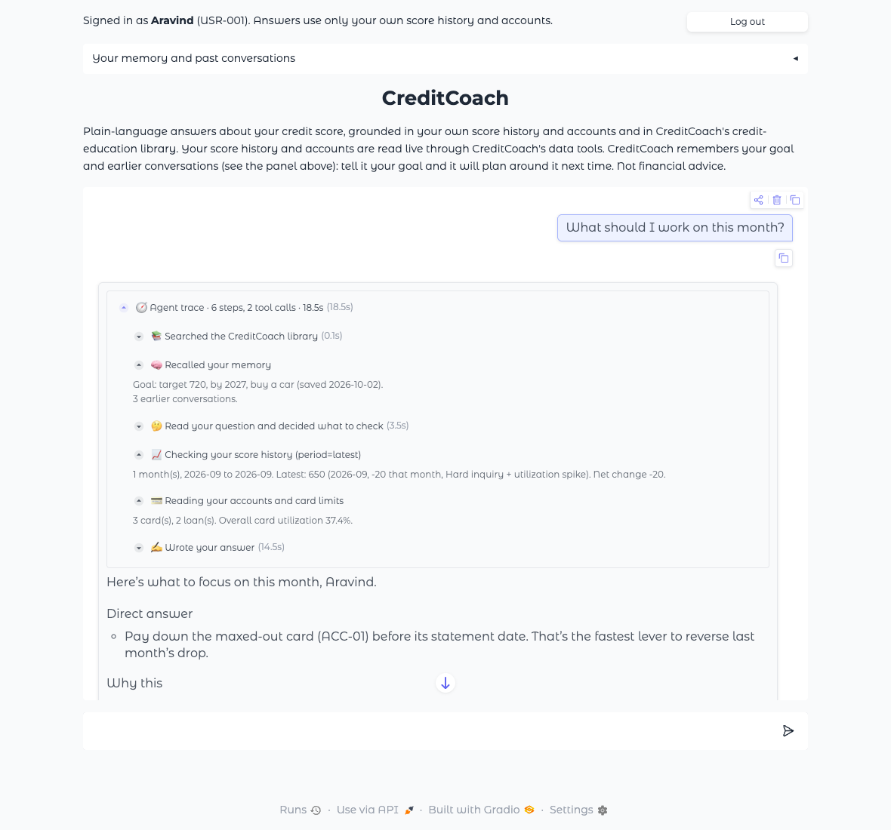

# Task 18 Evidence: Agent Trace Panel in the Chat UI

*2026-10-02 · Code: `creditcoach/app/trace.py` (the trace), `creditcoach/app/main.py` (streaming chat handler), `creditcoach/agent/pipeline.py` (progress events) · Tests: `tests/test_trace.py`*

**Definition of Done:** the panel lists each tool call and the recalled goal for the response.

**Evidence of Completion:** a screenshot of the panel expanded on a real query (below).

## How it works

The pipeline reports each step as it happens (`pipeline.Progress`): retrieval, memory recall, each model turn, and the start and end of each tool call. The chat handler runs the answer on a worker thread and streams those steps into the chat as one collapsible **Agent trace** block above the answer, redrawing every second so timers keep moving.

| While the user waits | After the answer arrives |
|---|---|
| Each step appears as it starts, with a spinner and a running timer: searching the library, recalling memory, deciding what to check, checking score history, reading accounts, writing the answer. | The block collapses to "🧭 Agent trace · 6 steps, 2 tool calls · 18.5s" and can be expanded. |
| During the slowest step (the model writing its answer), a short credit tip from the library rotates under it every 6 seconds ("💡 While you wait: …"). | Each tool call shows its arguments and a one-line result. The memory step shows the recalled goal and the number of earlier conversations. The library step lists the passages used. |

**Since 2026-10-02** both tools are fetched before the model's first turn (see [docs/tools.md](../../tools.md) §4), so the two data steps appear right after memory and the first model step is "Writing your answer"; a further tool call the model makes still appears as "Decided to check more of your data". The screenshots below show the order before that change.

The trace summarises results rather than dumping tool output: the answer carries the figures, and the trace shows where they came from. A failed tool call is marked ⚠️ with its error code (for example `DATA_UNAVAILABLE` after a retry). Trace steps are not sent back to the model as chat history, and they aren't stored in memory: the episode keeps the answer and which tools it used.

## Screenshots (real query, signed in as Aravind, USR-001, with the goal "720 by 2027 to buy a car" saved earlier)

Query: *"What should I work on this month?"* (requirements.md §4 #37). The app ran locally with live `openai/gpt-5` answers and both MCP tools; the login and memory folder were temporary.

**1. While waiting (about 8 seconds in).** Finished steps show their time. The model is writing, with a tip under the spinner.

**2. Answer arrived, panel expanded.** The trace lists the recalled goal ("target 720, by 2027, buy a car"), both tool calls with their arguments and results (score history `period=latest`: 650, −20, hard inquiry + utilization spike; accounts: 3 cards, 2 loans, overall utilization 37.4%), and the answer follows. The answer brings up the goal unprompted.

## Where the time goes

| Step | Time in this run |
|---|---|
| Searching the library | 0.1 s |
| Recalling memory | under 0.1 s |
| Model reads the question and decides what to check | 3.5 s |
| Both tool calls over MCP | under 0.1 s each |
| Model writes the answer | 14.5 s |
| **Total** | **18.5 s** |

Retrieval is fast. Nearly all the wait is the chat model (`openai/gpt-5`, reasoning effort `low`), which is why the trace puts its spinner and tip on that step. Ways to shorten the wait itself are already planned: streaming the answer's words as they're written (README roadmap item 11) and caching (Tasks 22–23).

## Checks

| Check | Result |
|---|---|
| Panel lists each tool call with its arguments and result | ✅ screenshot 2: `get_score_history (period=latest)`, `get_account_summary` |
| Panel shows the recalled goal for the response | ✅ screenshot 2: "Goal: target 720, by 2027, buy a car (saved 2026-10-02)" |
| Progress is visible while waiting | ✅ screenshot 1: steps, timer, spinner and tip |
| Failed tools, an answer-service failure, and an empty or signed-out message are handled | ✅ `tests/test_trace.py` (18 tests) |
| Answers and memory unchanged by the trace | ✅ the episode records the question and the answer only; the full test suite passes |
