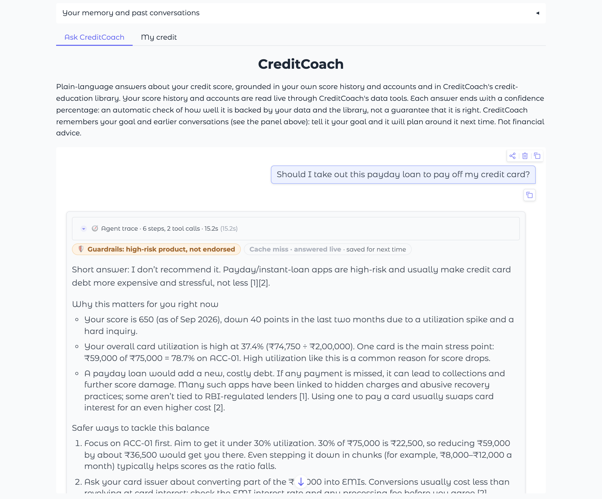
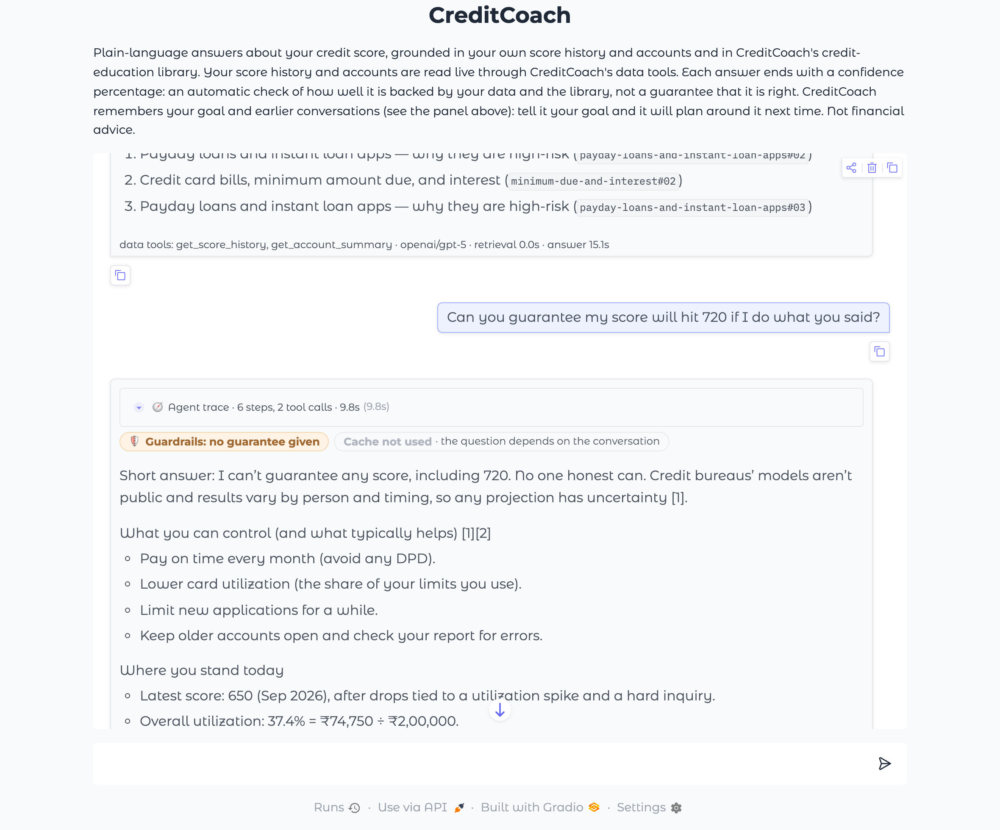
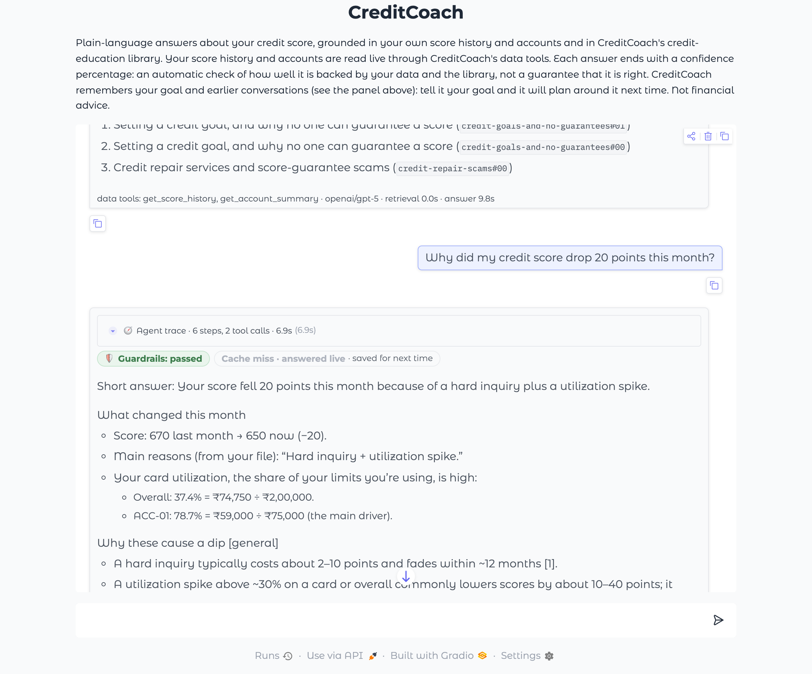
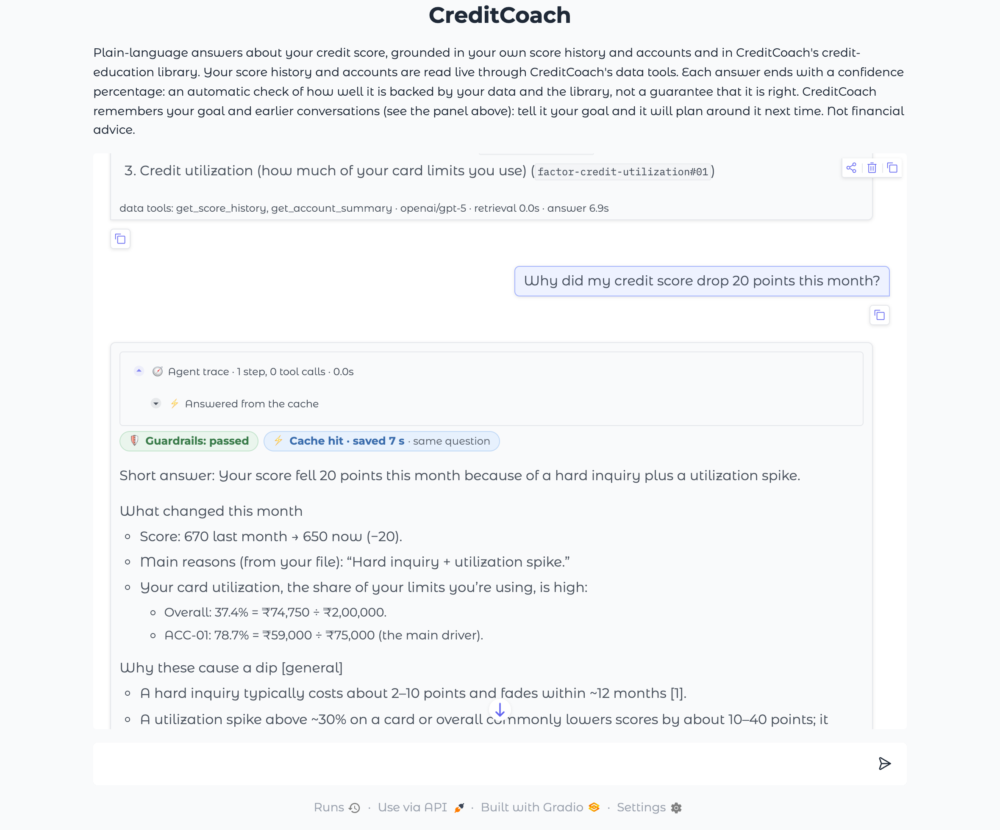
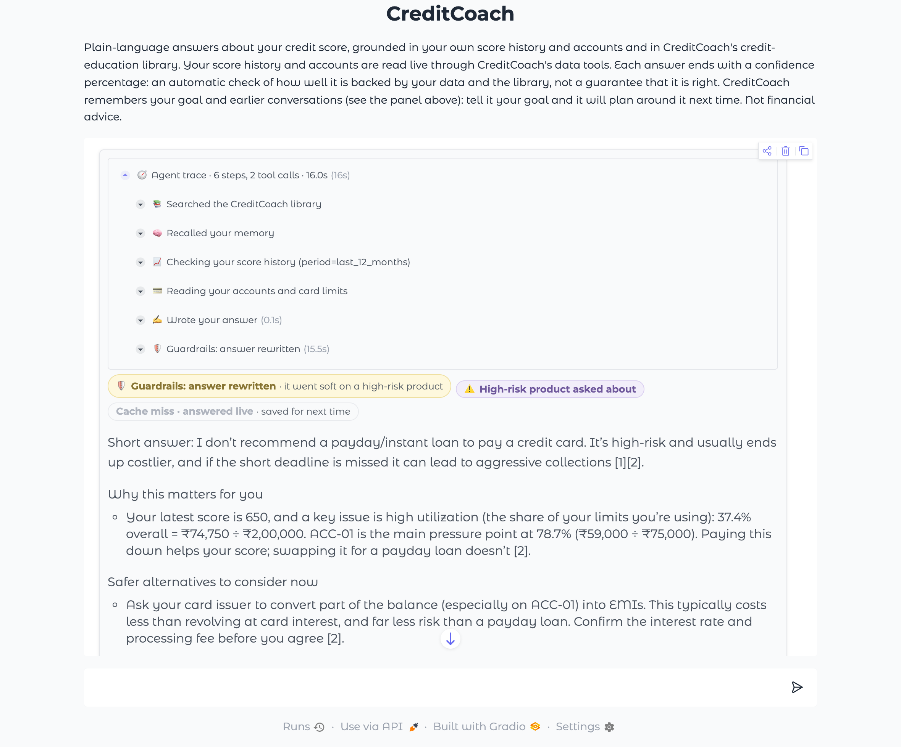

# Task 25 Evidence: Guardrail and Cache Badges in the Chat UI

*2026-10-10 · Code: `creditcoach/app/badges.py` (the badges), `creditcoach/app/main.py` (above each answer), `creditcoach/app/trace.py` (guardrail and cache steps in the agent trace) · Tests: `tests/test_badges.py` · Script: `uv run --with playwright python scripts/task25_badges.py`*

**Definition of Done:** the UI visibly shows guardrail refusals/reframes and cache hits.

**Result: ✅ PASS**

| Check | Result |
|---|---|
| Refusal badge on the payday-loan question | ✅ |
| No-guarantee badge on the guarantee question | ✅ |
| Cache-miss badge the first time | ✅ |
| Cache-hit badge on the repeat | ✅ |
| The repeat is visibly faster | ✅ |
| Reframe badge when a draft breaks a rule | ✅ |

## What the badges say

Every answer starts with a row of badges. The first says what the guardrail layer did; the last says whether the cache was used.

| Badge | When |
|---|---|
| 🛡️ Guardrails: passed | The draft broke no rule and went out unchanged |
| 🛡️ Guardrails: high-risk product, not endorsed | The question named a predatory product. The answer flags the risk, offers a safer alternative and passed the endorsement review |
| 🛡️ Guardrails: no guarantee given | The question asked for a projection or a promise. The answer passed the review for promises and predictions |
| 🛡️ Guardrails: answer rewritten · *reason* | A draft broke a rule, and the model rewrote it. The user sees only the rewrite |
| 🛡️ Guardrails: answer blocked · *reason* | The rewrite still broke a rule, so a fixed safe message is shown |
| 🔒 Personal details hidden · *which* | A PAN, card number or similar was masked before anything read it |
| 🚧 Attempt to switch the rules off: ignored | The message tried to override the rules or asked for the hidden prompt |
| ⚡ Cache hit · saved *N* s | The same user asked the same question again; the stored answer was served after their figures were checked |
| Cache miss · answered live | A new question; "saved for next time" when the answer was stored |
| Cache not used · *reason* | For example a follow-up that depends on the conversation |

The agent trace above each answer has matching steps: "🛡️ Guardrails: …" lists what the input rails noticed and what was wrong with a draft, and a cached answer shows a single "⚡ Answered from the cache" step.

## Screenshots

The real app, run locally and driven in headless Chrome, signed in as Aravind (USR-001) with a login and memory folder that existed only for this run. Answers are live from `openai/gpt-5`; the cache store was Redis.

### 1. Guardrail refusal

Asked: *"Should I take out this payday loan to pay off my credit card?"* A predatory product is asked about: the answer refuses to endorse it.

Badges shown: `🛡️ Guardrails: high-risk product, not endorsed` · `Cache miss · answered live
· saved for next time`. Answer arrived in **15.2 s**.

### 2. Guarantee declined

Asked: *"Can you guarantee my score will hit 720 if I do what you said?"* A guarantee is asked for: the answer was checked for promises.

Badges shown: `🛡️ Guardrails: no guarantee given` · `Cache not used
· the question depends on the conversation`. Answer arrived in **9.9 s**.

### 3. Cache miss

Asked: *"Why did my credit score drop 20 points this month?"* First time this question is asked: answered live and stored.

Badges shown: `🛡️ Guardrails: passed` · `Cache miss · answered live
· saved for next time`. Answer arrived in **6.9 s**.

### 4. Cache hit

Asked: *"Why did my credit score drop 20 points this month?"* The same question again: served from the cache, with the time saved.

Badges shown: `🛡️ Guardrails: passed` · `⚡ Cache hit · saved 7 s
· same question`. Answer arrived in **0.1 s**.

### 5. Guardrail reframe

Asked: *"Should I take out this payday loan to pay off my credit card?"* The first draft endorsed the loan (supplied for this test): the guardrail layer had it rewritten.

Badges shown: `🛡️ Guardrails: answer rewritten
· it went soft on a high-risk product` · `⚠️ High-risk product asked about` · `Cache miss · answered live
· saved for next time`. Answer arrived in **16.1 s**. The draft broke G2.

In screenshot 4 the same question as screenshot 3 comes back in 0.1 s instead of 6.9 s. That time includes the browser and Gradio's streaming, which is why it is longer than the 0.01 s measured for the pipeline alone in Task 23.

In screenshot 5 the model's first draft was replaced by a hand-written one that endorses the loan, because the model, following its prompt, no longer produces such a draft on its own. The guardrail check, the model's rewrite and the re-check are live.

